# Sistema de Gestión de Dispositivos - Proyecto DevOps

## 1. URL de la Página

**Frontend desplegado**: https://device-frontend-app.azurewebsites.net
**Backend API**: https://device-backend-app.azurewebsites.net
**Documentación Swagger**: https://device-backend-app.azurewebsites.net/swagger

---

## 2. Descripción del Proyecto

Este proyecto implementa un sistema completo de gestión y control de entradas/salidas de dispositivos (laptops externos y equipos biomédicos). El sistema permite registrar dispositivos con captura fotográfica, realizar check-in/check-out mediante códigos QR, mantener un historial completo de movimientos y proporcionar trazabilidad en tiempo real con autenticación de usuarios.

### Tecnologías y Librerías Utilizadas

#### Backend
- **Bun** (v1.0+): Runtime JavaScript de alto rendimiento
- **Elysia** (latest): Framework web moderno para APIs REST
- **TypeScript** (latest): Lenguaje de programación con tipado estático
- **SQLite** (3.x): Base de datos relacional embebida
- **Drizzle ORM** (0.44.5): ORM type-safe para TypeScript
- **Better Auth** (1.3.13): Sistema de autenticación con sesiones
- **Zod** (4.1.11): Validación de esquemas y datos
- **QRCode** (1.5.4): Generación de códigos QR
- **Azure Blob Storage** (12.28.0): Almacenamiento de fotografías en la nube
- **Application Insights** (3.3.0): Telemetría y monitoreo de Azure
- **Axiom JS** (1.0.0): Sistema de logging en tiempo real
- **@elysiajs/cors** (1.4.0): Manejo de CORS
- **@elysiajs/openapi** (1.4.10): Documentación automática de API

#### Frontend
- **React** (18.3.1): Biblioteca para interfaces de usuario
- **React Router DOM** (7.9.5): Enrutamiento en aplicaciones SPA
- **Vite** (5.2.0): Herramienta de build y servidor de desarrollo
- **Tailwind CSS** (4.1.17): Framework CSS utility-first
- **Lucide React** (0.263.1): Librería de iconos
- **Better Auth Client** (1.3.34): Cliente de autenticación

#### DevOps e Infraestructura
- **Docker**: Containerización de aplicaciones
- **Docker Compose**: Orquestación de servicios
- **GitHub Actions**: CI/CD automatizado
- **Azure Container Registry**: Registro de imágenes Docker
- **Azure Web Apps**: Plataforma de hosting
- **HURL**: Framework de testing de APIs
- **Nginx**: Servidor web para el frontend

---

## 3. Estructura del Proyecto

```
Proyecto_FINALDEVOPS/
├── back/
│   ├── src/
│   │   ├── adapter/
│   │   │   ├── api/
│   │   │   │   └── elysia/
│   │   │   │       ├── controller.elysia.ts
│   │   │   │       ├── elysia.api.ts
│   │   │   │       ├── criteria.helper.ts
│   │   │   │       └── index.ts
│   │   │   ├── photo/
│   │   │   │   └── filesystem/
│   │   │   │       ├── filesystem.photo-repository.ts
│   │   │   │       └── index.ts
│   │   │   └── repository/
│   │   │       ├── inmemory/
│   │   │       │   └── inmemory.device-repository.ts
│   │   │       └── sql/
│   │   │           ├── sql.device-repository.ts
│   │   │           └── index.ts
│   │   ├── core/
│   │   │   ├── auth/
│   │   │   │   ├── auth.config.ts
│   │   │   │   ├── auth.middleware.ts
│   │   │   │   └── index.ts
│   │   │   ├── domain/
│   │   │   │   ├── computer.domain.ts
│   │   │   │   ├── medical-device.domain.ts
│   │   │   │   ├── device-history.domain.ts
│   │   │   │   ├── criteria.domain.ts
│   │   │   │   ├── shared.domain.ts
│   │   │   │   └── index.ts
│   │   │   ├── dto/
│   │   │   │   ├── computer-request.dto.ts
│   │   │   │   ├── medical-device-request.dto.ts
│   │   │   │   └── index.ts
│   │   │   ├── repository/
│   │   │   │   ├── device.repository.ts
│   │   │   │   ├── photo.repository.ts
│   │   │   │   └── index.ts
│   │   │   ├── service/
│   │   │   │   ├── computer.service.ts
│   │   │   │   ├── medical-device.service.ts
│   │   │   │   ├── device.service.ts
│   │   │   │   ├── device-history.service.ts
│   │   │   │   ├── qr.service.ts
│   │   │   │   ├── error.ts
│   │   │   │   ├── helper.ts
│   │   │   │   └── index.ts
│   │   │   ├── utils/
│   │   │   │   ├── error-base.util.ts
│   │   │   │   ├── validation-schema.util.ts
│   │   │   │   ├── logger.ts
│   │   │   │   └── index.ts
│   │   │   └── constants.ts
│   │   └── index.ts
│   ├── public/
│   │   └── uploads/
│   ├── Dockerfile
│   ├── Dockerfile.bun
│   ├── package.json
│   └── .env
├── front/
│   └── device-frontend/
│       ├── src/
│       │   ├── components/
│       │   ├── pages/
│       │   ├── App.tsx
│       │   └── main.tsx
│       ├── public/
│       ├── Dockerfile
│       ├── nginx.conf
│       ├── package.json
│       └── vite.config.ts
├── tests/
│   ├── health.hurl
│   ├── auth.hurl
│   ├── computers.hurl
│   ├── medical-devices.hurl
│   └── devices.hurl
├── .github/
│   └── workflows/
│       └── azure-deploy.yml
├── docker-compose.yml
├── .env.example
└── README.md
```

---

## 4. Explicación de las Carpetas

### `back/src/adapter/`
Contiene los adaptadores que conectan el core de la aplicación con tecnologías externas. Esta capa implementa el patrón de arquitectura hexagonal (ports and adapters).

- **api/elysia/**: Implementa la capa de controladores HTTP utilizando el framework Elysia. Maneja las peticiones HTTP, valida datos de entrada, invoca servicios del core y retorna respuestas HTTP.
- **photo/filesystem/**: Adaptador para el almacenamiento de fotografías. Puede usar el sistema de archivos local o Azure Blob Storage según la configuración.
- **repository/sql/**: Implementación de repositorios usando SQLite con Drizzle ORM para la persistencia de datos.
- **repository/inmemory/**: Implementación de repositorios en memoria para pruebas y desarrollo.

### `back/src/core/`
Contiene la lógica de negocio pura del sistema, independiente de frameworks o tecnologías externas. Esta capa implementa los principios de Clean Architecture.

#### `core/auth/`
Sistema de autenticación y autorización. Contiene la configuración de Better Auth, middleware de autenticación para proteger rutas y validación de sesiones. Gestiona el ciclo de vida de las sesiones de usuario con cookies HTTP-only.

#### `core/domain/`
Modelos de dominio que representan las entidades del negocio:
- **computer.domain.ts**: Entidad de computadora/laptop con atributos como marca, modelo, color, propietario
- **medical-device.domain.ts**: Entidad de dispositivo médico con serial, marca, modelo
- **device-history.domain.ts**: Registro de entrada/salida de dispositivos con timestamps
- **criteria.domain.ts**: Criterios de búsqueda y filtrado
- **shared.domain.ts**: Tipos y valores compartidos entre dominios

#### `core/dto/`
Data Transfer Objects que definen la estructura de datos para comunicación entre capas:
- **computer-request.dto.ts**: DTO para peticiones de registro de computadoras
- **medical-device-request.dto.ts**: DTO para peticiones de dispositivos médicos

Estos DTOs incluyen validación con Zod para asegurar la integridad de los datos de entrada.

#### `core/repository/`
Interfaces (contratos) de repositorios que definen las operaciones de persistencia sin especificar la implementación:
- **device.repository.ts**: Interfaz para operaciones CRUD de dispositivos
- **photo.repository.ts**: Interfaz para operaciones de almacenamiento de fotos

#### `core/service/`
Servicios de negocio que implementan casos de uso y lógica de aplicación:
- **computer.service.ts**: Lógica de negocio para computadoras (check-in, listar, frecuentes)
- **medical-device.service.ts**: Lógica de negocio para dispositivos médicos
- **device.service.ts**: Operaciones generales de dispositivos
- **device-history.service.ts**: Gestión del historial de movimientos
- **qr.service.ts**: Generación de códigos QR para check-in/check-out rápido
- **error.ts**: Manejo de errores de negocio
- **helper.ts**: Funciones auxiliares

#### `core/utils/`
Utilidades y funciones de soporte:
- **error-base.util.ts**: Clases base para manejo de errores
- **validation-schema.util.ts**: Esquemas de validación con Zod
- **logger.ts**: Sistema de logging con integración a Axiom

### `front/device-frontend/src/`
Aplicación React con las siguientes carpetas:
- **components/**: Componentes React reutilizables (formularios, tablas, botones)
- **pages/**: Páginas de la aplicación (Login, Dashboard, Historial, etc.)

### `tests/`
Tests de API usando HURL para validación automatizada:
- **health.hurl**: Tests de disponibilidad y salud del sistema
- **auth.hurl**: Tests de autenticación y sesiones
- **computers.hurl**: Tests de endpoints de computadoras
- **medical-devices.hurl**: Tests de dispositivos médicos
- **devices.hurl**: Tests de endpoints generales

### `.github/workflows/`
Pipelines de CI/CD con GitHub Actions:
- **azure-deploy.yml**: Pipeline completo de build, test y deploy a Azure

### Archivos de Configuración

#### `back/.env`
Archivo de variables de entorno para configurar el backend:
- Credenciales de autenticación (BETTER_AUTH_SECRET, BETTER_AUTH_URL)
- Configuración de base de datos (DB_FILE_NAME)
- Credenciales de Azure Storage (AZURE_STORAGE_ACCOUNT, AZURE_STORAGE_KEY)
- Tokens de servicios (AXIOM_TOKEN, APPLICATIONINSIGHTS_CONNECTION_STRING)

#### `docker-compose.yml`
Orquestación de servicios Docker para desarrollo local. Define los servicios backend y frontend con sus respectivas configuraciones de red, volúmenes y variables de entorno.

---

## 5. Configuración y Entorno

### Variables de Entorno (`.env`)

#### Backend Configuration
```env
# Better Auth - Sistema de autenticación
BETTER_AUTH_SECRET=clave-secreta-minimo-32-caracteres
BETTER_AUTH_URL=http://localhost:3000
```
Estas variables configuran Better Auth. El SECRET debe ser una cadena aleatoria segura de al menos 32 caracteres. La URL debe apuntar a la dirección del backend.

#### Base de Datos
```env
# SQLite Database
DB_FILE_NAME=db.sqlite
```
Nombre del archivo de base de datos SQLite que se creará automáticamente en el directorio `back/`.

#### Azure Blob Storage (Opcional)
```env
AZURE_STORAGE_ACCOUNT=nombre-cuenta-storage
AZURE_STORAGE_KEY=clave-de-acceso
AZURE_CONTAINER_NAME=device-photos
```
Si estas variables están configuradas, las fotos se almacenan en Azure Blob Storage. Si no están presentes, se usa el sistema de archivos local en `back/public/uploads/`.

#### Observabilidad
```env
# Axiom Logging
AXIOM_TOKEN=xaat-xxxxxxxxxxxxxxxx
AXIOM_DATASET=device-management-logs

# Application Insights
APPLICATIONINSIGHTS_CONNECTION_STRING=InstrumentationKey=xxxxx;...
```
Configuración para telemetría y logging en tiempo real con Axiom y Application Insights de Azure.

#### Entorno de Ejecución
```env
NODE_ENV=development  # o 'production'
```

#### Frontend Configuration
```env
VITE_API_URL=http://localhost:3000/api
```
URL del backend que el frontend utilizará para hacer peticiones.

### Puertos Utilizados

| Servicio | Puerto | Descripción |
|----------|--------|-------------|
| Backend  | 3000   | API REST con Elysia |
| Frontend | 5173   | Aplicación React (desarrollo) |
| Frontend | 80     | Nginx en producción |

### Base de Datos

El proyecto utiliza **SQLite** como base de datos relacional embebida. Las tablas principales son:

- **user**: Almacena usuarios del sistema con credenciales hasheadas
- **session**: Gestiona sesiones activas de usuarios
- **computer**: Registro de laptops y computadoras
- **medical_device**: Registro de dispositivos médicos
- **device_history**: Historial de check-ins y check-outs
- **frequent_computer**: Computadoras frecuentes con códigos QR

La base de datos se crea automáticamente al iniciar el backend por primera vez. Drizzle ORM maneja las migraciones y el esquema.

---

## 6. Cómo Ejecutar el Proyecto

### Prerrequisitos

- **Bun** v1.0+ (para backend)
- **Node.js** v18+ (para frontend)
- **Git**
- **Docker** y **Docker Compose** (opcional, recomendado)

### Opción 1: Ejecución con Docker (Recomendado)

#### Paso 1: Clonar el repositorio
```bash
git clone https://github.com/yourusername/device-management.git
cd device-management
```

#### Paso 2: Configurar variables de entorno
```bash
cp .env.example .env
# Editar .env con tus valores
```

**Importante**: Asegúrate de cambiar `BETTER_AUTH_SECRET` por una cadena segura de al menos 32 caracteres.

#### Paso 3: Construir e iniciar servicios
```bash
docker-compose up --build
```

Este comando:
1. Construye las imágenes Docker para backend y frontend
2. Crea la red de Docker
3. Inicia ambos servicios
4. Monta volúmenes para persistencia de datos

#### Paso 4: Acceder a la aplicación
- **Frontend**: http://localhost:5173
- **Backend API**: http://localhost:3000
- **Documentación Swagger**: http://localhost:3000/swagger

#### Paso 5: Detener servicios
```bash
# Detener contenedores
docker-compose down

# Detener y eliminar volúmenes
docker-compose down -v
```

### Opción 2: Ejecución Local (Desarrollo)

#### Backend

1. **Navegar a la carpeta del backend**
```bash
cd back
```

2. **Instalar dependencias**
```bash
bun install
```

3. **Configurar variables de entorno**
```bash
cp .env.example .env
# Editar .env con tus valores
```

4. **Ejecutar en modo desarrollo**
```bash
bun run dev
```

El backend iniciará en http://localhost:3000 con hot-reload activado.

#### Frontend

1. **Abrir una nueva terminal y navegar al frontend**
```bash
cd front/device-frontend
```

2. **Instalar dependencias**
```bash
npm install
```

3. **Iniciar servidor de desarrollo**
```bash
npm run dev
```

El frontend iniciará en http://localhost:5173 con hot-reload activado.

### Opción 3: Build de Producción

#### Backend
```bash
cd back
bun install
# El backend no requiere build, se ejecuta directamente
bun run src/index.ts
```

#### Frontend
```bash
cd front/device-frontend
npm install
npm run build
# Los archivos optimizados estarán en dist/
```

Para servir el build de producción:
```bash
npm run preview
```

### Advertencias y Recomendaciones

- **No uses credenciales de producción en desarrollo local**
- **El archivo `.env` NUNCA debe subirse a Git** (está en .gitignore)
- La base de datos SQLite se crea automáticamente al iniciar el backend por primera vez
- En desarrollo local, el backend debe iniciarse antes que el frontend
- Para usar Azure Blob Storage, necesitas crear una cuenta de Storage en Azure Portal
- El puerto 3000 y 5173 deben estar libres en tu sistema

---

## 7. Endpoints o Peticiones Disponibles

### Autenticación

| Feature | Route | Method | Descripción |
|---------|-------|--------|-------------|
| Registro de usuario | `/api/auth/sign-up/email` | POST | Crea un nuevo usuario con email y contraseña |
| Inicio de sesión | `/api/auth/sign-in/email` | POST | Autentica un usuario y crea sesión |
| Cerrar sesión | `/api/auth/sign-out` | POST | Invalida la sesión actual |
| Obtener sesión | `/api/auth/get-session` | GET | Retorna información de la sesión actual |

### Computadoras

| Feature | Route | Method | Descripción |
|---------|-------|--------|-------------|
| Check-in laptop | `/api/computers/checkin` | POST | Registra entrada de laptop con foto opcional |
| Listar laptops | `/api/computers` | GET | Obtiene todas las laptops registradas |
| Registrar laptop frecuente | `/api/computers/frequent` | POST | Crea laptop frecuente con códigos QR |
| Listar laptops frecuentes | `/api/computers/frequent` | GET | Obtiene laptops marcadas como frecuentes |
| Check-in laptop frecuente | `/api/computers/frequent/checkin/:id` | PATCH | Check-in sin autenticación mediante QR |
| Obtener códigos QR | `/api/computers/frequent/:id/qrcodes` | GET | Retorna URLs y QR codes para check-in/out |

### Dispositivos Médicos

| Feature | Route | Method | Descripción |
|---------|-------|--------|-------------|
| Check-in dispositivo médico | `/api/medicaldevices/checkin` | POST | Registra entrada con foto obligatoria |
| Listar dispositivos médicos | `/api/medicaldevices` | GET | Obtiene todos los dispositivos médicos |

### Dispositivos Generales

| Feature | Route | Method | Descripción |
|---------|-------|--------|-------------|
| Dispositivos dentro | `/api/devices/entered` | GET | Lista dispositivos sin check-out |
| Historial completo | `/api/devices/history` | GET | Retorna historial de todos los movimientos |
| Hacer check-out | `/api/devices/checkout/:id` | PATCH | Registra salida de un dispositivo |

### Documentación

| Feature | Route | Method | Descripción |
|---------|-------|--------|-------------|
| Especificación OpenAPI | `/openapi` | GET | Retorna JSON con especificación OpenAPI 3.0 |
| Swagger UI | `/swagger` | GET | Interfaz interactiva para explorar la API |

### Ejemplos de Peticiones

#### Registro de Usuario
```bash
POST http://localhost:3000/api/auth/sign-up/email
Content-Type: application/json

{
  "name": "Juan Pérez",
  "email": "juan@example.com",
  "password": "SecurePassword123!"
}
```

#### Check-in de Laptop
```bash
POST http://localhost:3000/api/computers/checkin
Content-Type: multipart/form-data
Authorization: Cookie con sesión activa

{
  "brand": "Dell",
  "model": "Latitude 5420",
  "color": "Negro",
  "ownerName": "Juan Pérez",
  "ownerId": "123456789",
  "photo": [archivo de imagen]
}
```

#### Obtener Historial
```bash
GET http://localhost:3000/api/devices/history
Authorization: Cookie con sesión activa
```

---

## 8. Arquitectura del Proyecto

### Patrón Arquitectónico: Arquitectura Hexagonal (Ports and Adapters)

El proyecto implementa una arquitectura hexagonal combinada con principios de Clean Architecture para lograr:
- **Independencia de frameworks**: La lógica de negocio no depende de Elysia, React u otras tecnologías
- **Testeabilidad**: Los componentes core pueden testearse sin dependencias externas
- **Independencia de UI**: El core puede ser usado por web, mobile, CLI, etc.
- **Independencia de BD**: El dominio no conoce SQLite, puede cambiarse a PostgreSQL sin afectar el core

### Diagrama de Arquitectura por Capas

```
┌─────────────────────────────────────────────────────────────┐
│                    CAPA DE PRESENTACIÓN                      │
│                                                              │
│  ┌──────────────────────────────────────────────────────┐  │
│  │         Frontend (React + Vite)                      │  │
│  │  - Componentes React                                 │  │
│  │  - React Router (navegación)                         │  │
│  │  - Better Auth Client                                │  │
│  │  - Tailwind CSS (estilos)                            │  │
│  └──────────────────────────────────────────────────────┘  │
└───────────────────────┬──────────────────────────────────────┘
                        │ HTTP/REST
                        │
┌───────────────────────▼──────────────────────────────────────┐
│              CAPA DE ADAPTADORES (ADAPTER)                   │
│                                                              │
│  ┌──────────────────────────────────────────────────────┐  │
│  │  API REST (Elysia)                                   │  │
│  │  - Controllers (controller.elysia.ts)                │  │
│  │  - Routes definition                                 │  │
│  │  - Middleware (CORS, OpenAPI, Logging)               │  │
│  │  - Request/Response mapping                          │  │
│  └──────────────────────────────────────────────────────┘  │
│                                                              │
│  ┌──────────────────────────────────────────────────────┐  │
│  │  Photo Storage Adapter                               │  │
│  │  - Filesystem implementation                         │  │
│  │  - Azure Blob Storage implementation                 │  │
│  └──────────────────────────────────────────────────────┘  │
│                                                              │
│  ┌──────────────────────────────────────────────────────┐  │
│  │  Repository Adapter                                  │  │
│  │  - SQL Repository (Drizzle ORM + SQLite)             │  │
│  │  - InMemory Repository (para tests)                  │  │
│  └──────────────────────────────────────────────────────┘  │
└───────────────────────┬──────────────────────────────────────┘
                        │ Ports (Interfaces)
                        │
┌───────────────────────▼──────────────────────────────────────┐
│                 CAPA DE APLICACIÓN (CORE)                    │
│                                                              │
│  ┌──────────────────────────────────────────────────────┐  │
│  │  Services (Casos de Uso)                             │  │
│  │  - ComputerService                                   │  │
│  │  - MedicalDeviceService                              │  │
│  │  - DeviceService                                     │  │
│  │  - DeviceHistoryService                              │  │
│  │  - QRService                                         │  │
│  └──────────────────────────────────────────────────────┘  │
│                          │                                   │
│                          │ usa                               │
│                          ▼                                   │
│  ┌──────────────────────────────────────────────────────┐  │
│  │  Repository Interfaces (Ports)                       │  │
│  │  - DeviceRepository (interface)                      │  │
│  │  - PhotoRepository (interface)                       │  │
│  └──────────────────────────────────────────────────────┘  │
│                                                              │
│  ┌──────────────────────────────────────────────────────┐  │
│  │  DTOs (Data Transfer Objects)                        │  │
│  │  - ComputerRequestDTO                                │  │
│  │  - MedicalDeviceRequestDTO                           │  │
│  └──────────────────────────────────────────────────────┘  │
│                                                              │
│  ┌──────────────────────────────────────────────────────┐  │
│  │  Auth System                                         │  │
│  │  - Auth config (Better Auth)                         │  │
│  │  - Auth middleware                                   │  │
│  └──────────────────────────────────────────────────────┘  │
└───────────────────────┬──────────────────────────────────────┘
                        │
                        │
┌───────────────────────▼──────────────────────────────────────┐
│                  CAPA DE DOMINIO (CORE)                      │
│                                                              │
│  ┌──────────────────────────────────────────────────────┐  │
│  │  Domain Models (Entidades)                           │  │
│  │  - Computer                                          │  │
│  │  - MedicalDevice                                     │  │
│  │  - DeviceHistory                                     │  │
│  │  - Criteria                                          │  │
│  └──────────────────────────────────────────────────────┘  │
│                                                              │
│  ┌──────────────────────────────────────────────────────┐  │
│  │  Value Objects                                       │  │
│  │  - PhotoUrl                                          │  │
│  │  - DeviceType                                        │  │
│  └──────────────────────────────────────────────────────┘  │
│                                                              │
│  ┌──────────────────────────────────────────────────────┐  │
│  │  Utils                                               │  │
│  │  - Error handling                                    │  │
│  │  - Validation schemas (Zod)                          │  │
│  │  - Logger (Axiom integration)                        │  │
│  └──────────────────────────────────────────────────────┘  │
└──────────────────────────────────────────────────────────────┘

┌──────────────────────────────────────────────────────────────┐
│                  CAPA DE INFRAESTRUCTURA                     │
│                                                              │
│  ┌──────────────┐  ┌─────────────┐  ┌──────────────────┐   │
│  │   SQLite     │  │ Azure Blob  │  │  Axiom Logging   │   │
│  │   Database   │  │   Storage   │  │  App Insights    │   │
│  └──────────────┘  └─────────────┘  └──────────────────┘   │
└──────────────────────────────────────────────────────────────┘
```

### Descripción de Componentes Principales

#### **Frontend (Presentación)**
- Componentes React que renderizan la interfaz de usuario
- Comunicación con backend mediante fetch API
- Autenticación gestionada por Better Auth Client
- Enrutamiento con React Router

#### **Adapter Layer**
- **Controllers**: Reciben peticiones HTTP, validan datos, invocan servicios
- **Repository Implementations**: Implementan las interfaces definidas en el core
- **Photo Storage**: Abstracción para almacenar fotos (filesystem o Azure)

#### **Core Layer (Aplicación)**
- **Services**: Implementan casos de uso y lógica de negocio
- **Repository Interfaces**: Contratos que deben cumplir los adaptadores
- **DTOs**: Estructuras de datos para transferencia entre capas
- **Auth**: Sistema de autenticación y autorización

#### **Domain Layer**
- **Entities**: Modelos de dominio con lógica de negocio
- **Value Objects**: Objetos inmutables que representan conceptos del dominio
- **Validations**: Reglas de negocio y validaciones

#### **Infrastructure**
- **SQLite**: Persistencia de datos
- **Azure Blob Storage**: Almacenamiento de archivos
- **Axiom/App Insights**: Observabilidad y telemetría

### Flujo de una Petición

```
1. Usuario → Frontend (React)
2. Frontend → HTTP Request → Backend Controller (Elysia)
3. Controller → Valida sesión (Auth Middleware)
4. Controller → Parsea y valida datos (DTO + Zod)
5. Controller → Invoca Service
6. Service → Ejecuta lógica de negocio
7. Service → Llama a Repository (interface)
8. Repository → Persiste en SQLite (implementación)
9. Service → Retorna resultado
10. Controller → Mapea a HTTP Response
11. Frontend → Actualiza UI
12. Logger → Envía evento a Axiom
```

### Patrones de Diseño Utilizados

1. **Dependency Injection**: Los servicios reciben repositorios por constructor
2. **Repository Pattern**: Abstracción de la capa de datos
3. **DTO Pattern**: Objetos para transferencia de datos
4. **Middleware Pattern**: Auth middleware, logging middleware
5. **Factory Pattern**: Creación de instancias de servicios y repositorios
6. **Strategy Pattern**: Diferentes implementaciones de PhotoRepository

### Principios SOLID Aplicados

- **Single Responsibility**: Cada clase tiene una única responsabilidad
- **Open/Closed**: Extensible sin modificar código existente (adaptadores)
- **Liskov Substitution**: Las implementaciones son intercambiables
- **Interface Segregation**: Interfaces pequeñas y específicas
- **Dependency Inversion**: El core depende de abstracciones, no de implementaciones

### Diagrama de Clases UML

```mermaid
classDiagram
    %% ========================================
    %% DOMAIN LAYER (Core/Domain)
    %% ========================================

    class Computer {
        +id: number
        +brand: string
        +model: string
        +color?: string
        +ownerName: string
        +ownerId: string
        +photoUrl?: string
        +createdAt: Date
    }

    class MedicalDevice {
        +id: number
        +brand: string
        +model: string
        +serial: string
        +ownerName: string
        +ownerId: string
        +photoUrl: string
        +createdAt: Date
    }

    class DeviceHistory {
        +id: number
        +deviceType: DeviceType
        +deviceId: number
        +checkinDate: Date
        +checkoutDate?: Date
        +ownerName: string
        +ownerId: string
        +brand: string
        +model: string
        +photoUrl?: string
    }

    class FrequentComputer {
        +id: number
        +brand: string
        +model: string
        +color?: string
        +ownerName: string
        +ownerId: string
        +photoUrl?: string
        +checkinUrl: string
        +checkoutUrl: string
        +createdAt: Date
    }

    class DeviceType {
        <<enumeration>>
        COMPUTER
        MEDICAL_DEVICE
    }

    class User {
        +id: string
        +name: string
        +email: string
        +emailVerified: boolean
        +createdAt: Date
        +updatedAt: Date
    }

    class Session {
        +id: string
        +userId: string
        +expiresAt: Date
        +token: string
        +ipAddress?: string
        +userAgent?: string
    }

    %% ========================================
    %% DTO LAYER (Core/DTO)
    %% ========================================

    class ComputerRequestDTO {
        +brand: string
        +model: string
        +color?: string
        +ownerName: string
        +ownerId: string
        +photo?: File
        +validate(): boolean
    }

    class MedicalDeviceRequestDTO {
        +brand: string
        +model: string
        +serial: string
        +ownerName: string
        +ownerId: string
        +photo: File
        +validate(): boolean
    }

    %% ========================================
    %% REPOSITORY INTERFACES (Core/Repository)
    %% ========================================

    class DeviceRepository {
        <<interface>>
        +saveComputer(computer: Computer): Promise~Computer~
        +saveMedicalDevice(device: MedicalDevice): Promise~MedicalDevice~
        +saveFrequentComputer(computer: FrequentComputer): Promise~FrequentComputer~
        +findComputerById(id: number): Promise~Computer~
        +findMedicalDeviceById(id: number): Promise~MedicalDevice~
        +findFrequentComputerById(id: number): Promise~FrequentComputer~
        +listComputers(): Promise~Computer[]~
        +listMedicalDevices(): Promise~MedicalDevice[]~
        +listFrequentComputers(): Promise~FrequentComputer[]~
        +saveHistory(history: DeviceHistory): Promise~DeviceHistory~
        +listHistory(): Promise~DeviceHistory[]~
        +listEnteredDevices(): Promise~DeviceHistory[]~
        +updateHistory(id: number, data: Partial~DeviceHistory~): Promise~DeviceHistory~
    }

    class PhotoRepository {
        <<interface>>
        +save(photo: File, filename: string): Promise~string~
        +delete(photoUrl: string): Promise~void~
    }

    %% ========================================
    %% SERVICE LAYER (Core/Service)
    %% ========================================

    class ComputerService {
        -deviceRepository: DeviceRepository
        -photoRepository: PhotoRepository
        +constructor(deviceRepo, photoRepo)
        +checkin(dto: ComputerRequestDTO): Promise~Computer~
        +listAll(): Promise~Computer[]~
        +createFrequent(dto: ComputerRequestDTO): Promise~FrequentComputer~
        +listFrequent(): Promise~FrequentComputer[]~
        +checkinFrequent(id: number): Promise~DeviceHistory~
        +getQRCodes(id: number): Promise~QRCodeData~
    }

    class MedicalDeviceService {
        -deviceRepository: DeviceRepository
        -photoRepository: PhotoRepository
        +constructor(deviceRepo, photoRepo)
        +checkin(dto: MedicalDeviceRequestDTO): Promise~MedicalDevice~
        +listAll(): Promise~MedicalDevice[]~
    }

    class DeviceService {
        -deviceRepository: DeviceRepository
        +constructor(deviceRepo)
        +checkout(historyId: number): Promise~DeviceHistory~
        +listEntered(): Promise~DeviceHistory[]~
    }

    class DeviceHistoryService {
        -deviceRepository: DeviceRepository
        +constructor(deviceRepo)
        +listAll(): Promise~DeviceHistory[]~
        +findById(id: number): Promise~DeviceHistory~
    }

    class QRService {
        +generateQR(text: string): Promise~string~
        +generateCheckinQR(baseUrl: string, deviceId: number): Promise~string~
        +generateCheckoutQR(baseUrl: string, deviceId: number): Promise~string~
    }

    %% ========================================
    %% ADAPTER LAYER - Repository Implementations
    %% ========================================

    class SQLDeviceRepository {
        -db: DrizzleDB
        +constructor(db)
        +saveComputer(computer: Computer): Promise~Computer~
        +saveMedicalDevice(device: MedicalDevice): Promise~MedicalDevice~
        +saveFrequentComputer(computer: FrequentComputer): Promise~FrequentComputer~
        +findComputerById(id: number): Promise~Computer~
        +findMedicalDeviceById(id: number): Promise~MedicalDevice~
        +findFrequentComputerById(id: number): Promise~FrequentComputer~
        +listComputers(): Promise~Computer[]~
        +listMedicalDevices(): Promise~MedicalDevice[]~
        +listFrequentComputers(): Promise~FrequentComputer[]~
        +saveHistory(history: DeviceHistory): Promise~DeviceHistory~
        +listHistory(): Promise~DeviceHistory[]~
        +listEnteredDevices(): Promise~DeviceHistory[]~
        +updateHistory(id: number, data: Partial~DeviceHistory~): Promise~DeviceHistory~
    }

    class InMemoryDeviceRepository {
        -computers: Computer[]
        -medicalDevices: MedicalDevice[]
        -frequentComputers: FrequentComputer[]
        -history: DeviceHistory[]
        +saveComputer(computer: Computer): Promise~Computer~
        +saveMedicalDevice(device: MedicalDevice): Promise~MedicalDevice~
        +listComputers(): Promise~Computer[]~
        +listMedicalDevices(): Promise~MedicalDevice[]~
        +listHistory(): Promise~DeviceHistory[]~
    }

    class FilesystemPhotoRepository {
        -uploadDir: string
        +constructor(uploadDir)
        +save(photo: File, filename: string): Promise~string~
        +delete(photoUrl: string): Promise~void~
    }

    class AzureBlobPhotoRepository {
        -blobServiceClient: BlobServiceClient
        -containerName: string
        +constructor(connectionString, containerName)
        +save(photo: File, filename: string): Promise~string~
        +delete(photoUrl: string): Promise~void~
    }

    %% ========================================
    %% ADAPTER LAYER - API Controllers
    %% ========================================

    class Controller {
        -computerService: ComputerService
        -deviceService: DeviceService
        -medicalDeviceService: MedicalDeviceService
        -deviceHistoryService: DeviceHistoryService
        +constructor(computerSvc, deviceSvc, medicalSvc, historySvc)
        +routes(): ElysiaApp
        -handleComputerCheckin(request): Response
        -handleMedicalDeviceCheckin(request): Response
        -handleDeviceCheckout(id: number): Response
        -handleGetHistory(): Response
        -handleGetEnteredDevices(): Response
    }

    class ElysiaApiAdapter {
        -controller: Controller
        +app: Elysia
        +constructor(computerSvc, deviceSvc, medicalSvc, historySvc)
        +run(): void
    }

    class AuthMiddleware {
        +authenticate(request): User
        +requireAuth(handler): Handler
    }

    %% ========================================
    %% UTILITY CLASSES
    %% ========================================

    class Logger {
        -axiomClient: AxiomClient
        +info(message: string, data?: object): void
        +error(message: string, error: Error, data?: object): void
        +warn(message: string, data?: object): void
        +metric(name: string, value: number, data?: object): void
    }

    class ValidationSchema {
        +computerSchema: ZodSchema
        +medicalDeviceSchema: ZodSchema
        +validate~T~(schema: ZodSchema, data: unknown): T
    }

    class ErrorBase {
        +message: string
        +statusCode: number
        +constructor(message, statusCode)
    }

    class NotFoundError {
        +constructor(message)
    }

    class ValidationError {
        +errors: ValidationIssue[]
        +constructor(message, errors)
    }

    %% ========================================
    %% RELATIONSHIPS
    %% ========================================

    %% Services depend on Repository Interfaces
    ComputerService --> DeviceRepository : uses
    ComputerService --> PhotoRepository : uses
    MedicalDeviceService --> DeviceRepository : uses
    MedicalDeviceService --> PhotoRepository : uses
    DeviceService --> DeviceRepository : uses
    DeviceHistoryService --> DeviceRepository : uses

    %% Services work with Domain Models
    ComputerService ..> Computer : creates
    ComputerService ..> FrequentComputer : creates
    ComputerService ..> DeviceHistory : creates
    MedicalDeviceService ..> MedicalDevice : creates
    MedicalDeviceService ..> DeviceHistory : creates
    DeviceService ..> DeviceHistory : updates
    DeviceHistoryService ..> DeviceHistory : reads

    %% Services receive DTOs
    ComputerService ..> ComputerRequestDTO : receives
    MedicalDeviceService ..> MedicalDeviceRequestDTO : receives

    %% Repository implementations
    SQLDeviceRepository ..|> DeviceRepository : implements
    InMemoryDeviceRepository ..|> DeviceRepository : implements
    FilesystemPhotoRepository ..|> PhotoRepository : implements
    AzureBlobPhotoRepository ..|> PhotoRepository : implements

    %% Controllers use Services
    Controller --> ComputerService : uses
    Controller --> DeviceService : uses
    Controller --> MedicalDeviceService : uses
    Controller --> DeviceHistoryService : uses

    %% API Adapter uses Controller
    ElysiaApiAdapter --> Controller : uses
    ElysiaApiAdapter --> AuthMiddleware : uses

    %% Domain relationships
    DeviceHistory --> DeviceType : has
    User --> Session : has many

    %% Utility usage
    ComputerService --> Logger : logs
    MedicalDeviceService --> Logger : logs
    Controller --> ValidationSchema : validates
    Controller --> ErrorBase : throws

    %% Error hierarchy
    NotFoundError --|> ErrorBase : extends
    ValidationError --|> ErrorBase : extends
```



Este diagrama UML muestra:

1. **Capa de Dominio**: Entidades como Computer, MedicalDevice, DeviceHistory, User, Session
2. **Capa de DTOs**: ComputerRequestDTO, MedicalDeviceRequestDTO para transferencia de datos
3. **Interfaces de Repositorio**: DeviceRepository, PhotoRepository (contratos)
4. **Servicios de Aplicación**: ComputerService, MedicalDeviceService, DeviceService, etc.
5. **Implementaciones de Repositorio**: SQLDeviceRepository, InMemoryDeviceRepository, FilesystemPhotoRepository, AzureBlobPhotoRepository
6. **Controladores**: Controller, ElysiaApiAdapter, AuthMiddleware
7. **Utilidades**: Logger, ValidationSchema, ErrorBase y sus derivados

Las relaciones muestran cómo los servicios dependen de abstracciones (interfaces) y no de implementaciones concretas, siguiendo el Principio de Inversión de Dependencias.

---

## 9. Testing

### Tipos de Tests Implementados

#### Tests Unitarios
Ubicados en archivos `*.test.ts` junto a los archivos de implementación:
- `inmemory.device-repository.test.ts`: Tests del repositorio en memoria
- `sql.device-repository.test.ts`: Tests del repositorio SQL
- `filesystem.photo-repository.test.ts`: Tests del repositorio de fotos

#### Tests de Integración (HURL)
Ubicados en la carpeta `tests/`:

```bash
# Ejecutar todos los tests
cd tests
hurl --test --variable base_url=http://localhost:3000 health.hurl
hurl --test --variable base_url=http://localhost:3000 auth.hurl
hurl --test --variable base_url=http://localhost:3000 computers.hurl
hurl --test --variable base_url=http://localhost:3000 medical-devices.hurl
hurl --test --variable base_url=http://localhost:3000 devices.hurl
```

**Cobertura de Tests**:
- Health checks: 3 tests
- Autenticación: 5 tests
- Computadoras: 7 tests
- Dispositivos médicos: 3 tests
- Dispositivos generales: 6 tests
- **Total: 24 tests automatizados**

### Ejecutar Tests en CI/CD

Los tests se ejecutan automáticamente en el pipeline de GitHub Actions después de cada despliegue:

```yaml
- name: Run HURL Tests
  run: |
    hurl --test --variable base_url=${{ env.BACKEND_URL }} tests/*.hurl
```

---

## 10. Despliegue Continuo (CI/CD)

### Pipeline de GitHub Actions

El archivo `.github/workflows/azure-deploy.yml` implementa un pipeline completo:

#### **Stage 1: Build Backend**
1. Setup Bun runtime
2. Instalar dependencias (`bun install`)
3. Ejecutar tests unitarios
4. Validar código TypeScript

#### **Stage 2: Build Frontend**
1. Setup Node.js
2. Instalar dependencias (`npm install`)
3. Build de producción (`npm run build`)
4. Validar bundle generado

#### **Stage 3: Docker Build & Push**
1. Login a Azure Container Registry
2. Build de imagen Docker backend
3. Build de imagen Docker frontend
4. Tag de imágenes con versión
5. Push a Azure Container Registry

#### **Stage 4: Deploy to Azure**
1. Login a Azure con Service Principal
2. Update de imagen en Azure Web App (backend)
3. Update de imagen en Azure Web App (frontend)
4. Configurar variables de entorno
5. Restart de servicios

#### **Stage 5: Testing**
1. Wait 30 segundos (warm-up)
2. Ejecutar tests HURL contra producción
3. Validar disponibilidad de servicios

#### **Stage 6: Notification**
1. Generar reporte de despliegue
2. Notificar status (success/failure)

### Secretos de GitHub Actions Requeridos

| Secret | Descripción |
|--------|-------------|
| `AZURE_CREDENTIALS` | JSON con credenciales del Service Principal |
| `ACR_USERNAME` | Usuario del Azure Container Registry |
| `ACR_PASSWORD` | Password del Azure Container Registry |
| `BETTER_AUTH_SECRET` | Secret key para Better Auth (32+ caracteres) |
| `APPLICATIONINSIGHTS_CONNECTION_STRING` | Connection string de Application Insights |
| `AXIOM_TOKEN` | Token de API de Axiom |
| `AXIOM_DATASET` | Nombre del dataset en Axiom |
| `AZURE_STORAGE_ACCOUNT` | Nombre de la cuenta de Azure Storage |
| `AZURE_STORAGE_KEY` | Key de la cuenta de Azure Storage |
| `AZURE_CONTAINER_NAME` | Nombre del contenedor de blobs |

### Trigger del Pipeline

El pipeline se ejecuta automáticamente en:
- Push a la rama `main`
- Pull request hacia `main`
- Ejecución manual desde GitHub Actions UI

---

## 11. Monitoreo y Observabilidad

### Application Insights (Azure)

**Métricas capturadas automáticamente**:
- Requests por segundo
- Tiempos de respuesta (avg, p50, p95, p99)
- Tasa de errores y excepciones
- Dependencias (DB queries, HTTP calls)
- Performance counters (CPU, Memory)

**Acceso**: Azure Portal → Resource Group `rg-device-management` → Application Insights

### Axiom Logging

**Eventos registrados**:
```typescript
// Eventos de sistema
logger.info('Application starting...', { nodeEnv, timestamp });

// Eventos de negocio
logger.info('Device checked in', {
  deviceType, deviceId, brand, model, ownerName
});

// HTTP Requests
logger.info('POST /api/computers/checkin', {
  statusCode: 200,
  executionTime: '245ms',
  userAgent,
  ip
});

// Errores
logger.error('Database query failed', error, {
  endpoint, userId, query
});
```

**Acceso**: https://app.axiom.co → Dataset `device-management-logs`

### Dashboards Recomendados

#### Dashboard Operacional
- Total de dispositivos registrados (hoy/semana/mes)
- Dispositivos actualmente dentro del edificio
- Tasa de check-ins vs check-outs
- Usuarios activos

#### Dashboard Técnico
- Latencia promedio de endpoints
- Tasa de errores HTTP (4xx, 5xx)
- Queries más lentas a la base de datos
- Uptime del servicio

---

## 12. Seguridad

### Autenticación
- Passwords hasheados con **bcrypt** (10 rounds)
- Sesiones con cookies **HTTP-only** y **SameSite**
- Tokens de sesión aleatorios y seguros
- Expiración automática de sesiones (7 días)

### Autorización
- Middleware de autenticación en todas las rutas protegidas
- Validación de sesión en cada request
- Rutas públicas solo para QR check-in y documentación

### Validación de Datos
- Validación de entrada con **Zod schemas**
- Sanitización de strings para prevenir XSS
- Validación de tipos con TypeScript
- Límites de tamaño de archivos (fotos max 5MB)

### Protección contra Ataques
- **SQL Injection**: Uso de Drizzle ORM con prepared statements
- **XSS**: Sanitización automática de React
- **CSRF**: Cookies con flag SameSite=Lax
- **CORS**: Lista blanca de orígenes permitidos
- **Rate Limiting**: Implementado en Azure Web Apps

### Variables de Entorno
- Secretos NUNCA en código fuente
- Archivo `.env` en `.gitignore`
- Secretos en GitHub Secrets para CI/CD
- Azure Key Vault recomendado para producción

---

## 13. Troubleshooting Común

### Error: "Database locked"
**Causa**: SQLite no soporta escrituras concurrentes
**Solución**: Reiniciar el backend o migrar a PostgreSQL para producción

### Error: "BETTER_AUTH_SECRET must be at least 32 characters"
**Causa**: Secret key muy corto
**Solución**: Generar secret seguro:
```bash
node -e "console.log(require('crypto').randomBytes(32).toString('base64'))"
```

### Error: "Failed to upload photo to Azure"
**Causa**: Credenciales incorrectas o contenedor no existe
**Solución**: Verificar variables de entorno y crear contenedor en Azure Portal

### Frontend no conecta con Backend
**Causa**: CORS o URL incorrecta
**Solución**: Verificar `VITE_API_URL` en `.env` del frontend y origen en CORS del backend

---

**Universidad**: [Tu Universidad]
**Materia**: DevOps
**Semestre**: 9no Semestre
**Desarrolladores**: Juan Miguel Ramirez Mancilla, Daniel Ramirez Muñoz, Daniel Ospina ,Daniel Nuñez
**Fecha**: Noviembre 2025
**Versión**: 1.0.0

---


